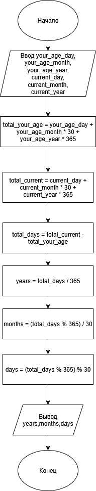

# Домашнее задание к лабораторной работе 3

## Условие задачи

Написать и отладить программу вычисления возраста по дате рождения

## 1. Алгоритм и блок-схема


### Алгоритм
1. **Начало**
2. Задать исходные данные:
    - `your_age_day`,`your_age_month`,`your_age_year` - день, месяц, год рождения
    - `current_day`,`current_month`,`current_year` - текущий день, месяц, год
    - `age`,`total_days`,`years`,`months`,`days` - результаты вычислений
3. Вычислить общее количество дней в дате рождения:
    - `total_your_age` = `your_age_day` + `your_age_month` * 30 + `your_age_year` * 365
4. Вычислить общее количество дней в текущей дате::
    - `total_current` = `current_day` + `current_month` * 30 + `current_year` * 365
5. Вычислить разницу в днях:
    - `total_days` = `total_current` - `total_your_age`
6. Разложить общее количество лет:
    - `years` = `total_days` - 365
7. Разложить общее количество месяцев:
    - `months` = (`total_days` % 365) / 30
8. Разложить общее количество дней:
    - `days` = (`total_days` % 365) % 30
9. Вывести результаты расчетов с подстановкой всех значений в текст.
10. **Конец**

### Блок-схема

## 2. Реализация программы
```
int main() 
{
    setlocale(LC_CTYPE, "RUS");

    int your_age_day, your_age_month, your_age_year;
    int current_day, current_month, current_year;
    int age, total_days, years, months, days;

    printf("Введите число вашего рождения\n");
    scanf("%d", &your_age_day);
    printf("Введите месяц вашего рождения\n");
    scanf("%d", &your_age_month);
    printf("Введите год вашего рождения\n");
    scanf("%d", &your_age_year);

    printf("Введите сегодняшнее число\n");
    scanf("%d", &current_day);
    printf("Введите текущий месяц\n");
    scanf("%d", &current_month);
    printf("Введите текущий год\n");
    scanf("%d", &current_year);


    int total_your_age = your_age_day + your_age_month * 30 + your_age_year * 365;
    int total_current = current_day + current_month * 30 + current_year * 365;

    total_days = total_current - total_your_age;

    years = total_days / 365;
    months = (total_days % 365) / 30;
    days = (total_days % 365) % 30;

    puts("___________________________________");
    printf("Дата рождения: %02d.%02d.%d\n", your_age_day, your_age_month, your_age_year);
    printf("Текущая дата:  %02d.%02d.%d\n", current_day, current_month, current_year);
    printf("Ваш возраст = %d лет, %d месяцев, %d дней\n", years, months, days);

    return 0;
}
```
## 3. Результаты работы программы
Написать и отладить программу вычисления возраста по дате рождения
___________________________________
Дата рождения: 20.09.2004
Текущая дата:  24.09.2025
Ваш возраст = 21 лет, 0 месяцев, 4 дней

[После запуска программы просто скопируйте вывод из консоли и вставьте его в этот раздел ]
